# Google Ads, website and Zoho CRM integration architecture

Implementation index: [audit report](audit-report.md) · [implementation plan](implementation-plan.md) · [field mapping](field-mapping.md) · [Google setup](google-ads-setup.md) · [Zoho setup](zoho-crm-setup.md) · [signed-callback template](zoho-signer-example.md) · [deployment](deployment.md) · [rollback](rollback.md) · [troubleshooting](troubleshooting.md) · [verification](verification-checklist.md) · [low-code fallback](low-code-fallback.md)

Status: implementation design, not a live-system verification

Prepared: 4 August 2026

Selected upload method: Google Data Manager API `v1`

## Canonical lead identity

`lead_submissions.id` is the one canonical, server-generated Emitronix lead ID. It is an opaque UUID-sized identifier, contains no customer data, and is never derived from a Zoho record ID, email, phone number, click ID, or browser value.

| Layer | Field | Required value |
|---|---|---|
| Website response / GTM `dataLayer` | `lead_id` and `event_id` | Exact canonical Emitronix lead ID |
| GTM Google Ads Website Lead tag | Transaction ID | `{{DLV - lead_id}}` unchanged |
| Zoho Leads | Emitronix Lead ID (`websiteSubmissionId` logical mapping) | Exact canonical Emitronix lead ID |
| Zoho Deals, before `deal_won` | Emitronix Lead ID | Exact ID copied from the originating Lead |
| Google Data Manager: Qualified, Meeting, Quotation, Won | `events[].transactionId` | Exact same canonical Emitronix lead ID |
| Private conversion ledger | `source_submission_id`, `transaction_id` | Equal for every identity-version-2 job |

Google deduplicates transaction/order IDs within a conversion action. Reusing one lead ID across separate funnel-stage conversion actions therefore records at most one event per lead per action while preserving one end-to-end reconciliation key. The separate browser `submission_id` remains a transport/idempotency UUID and is never a Google transaction ID.

Legacy conversion jobs created before schema version 5 retain their original Zoho-derived transaction IDs (`identity_version=1`). Rewriting an already uploaded order ID could create a duplicate, so only new jobs use the canonical identity contract (`identity_version=2`).

## Identity and scope

The repository's verified business source, `data/site.ts`, identifies the business as **Emitronix Contracting LLC** and the website as `https://emitronix.ae`. The request supplied the different name “Emitronix Building Contracting LLC.” This design uses the repository value and does not treat the supplied variation as a verified legal-name change. An authorised business owner must resolve the discrepancy before changing Google Ads billing, Zoho organisation data, legal text, or structured data.

The integration covers website project enquiries attributed to Google Ads and later CRM milestones. It does not make every CRM status a bidding conversion, does not upload Junk/spam records, and does not configure Meta Ads.

## Decision

Use a first-party, server-controlled integration:

- The browser records first- and latest-touch attribution and submits it with the enquiry.
- The website validates and stores an idempotent integration record before creating or updating a Zoho Lead.
- Zoho remains the source of truth for lead qualification and commercial stages.
- A signed Zoho callback identifies a changed record; the website fetches the current record from Zoho rather than trusting conversion data in the callback.
- The website uploads eligible CRM milestones with [Google Data Manager API `v1`](https://developers.google.com/data-manager/api/devguides/events) and Enhanced Conversions for Leads where consent permits.
- Upload request IDs are retained and checked through [Data Manager diagnostics](https://developers.google.com/data-manager/api/devguides/diagnostics). An accepted ingestion request is not treated as a final successful destination conversion until diagnostics complete.

Do not build a new integration around Google Ads API `UploadClickConversions`. Since 15 June 2026, developer tokens with no qualifying offline-upload history in the specified eligibility window are restricted; requests return `CUSTOMER_NOT_ALLOWLISTED_FOR_THIS_FEATURE`. Google directs affected integrations to Data Manager API. See the [Google Ads API deprecation and access-restriction notice](https://developers.google.com/google-ads/api/docs/deprecations).

## Architecture

```mermaid
flowchart LR
    A[Google Ads click] -->|gclid, gbraid or wbraid; ValueTrack; UTM| B[emitronix.ae]
    B --> C[Consent-aware attribution capture]
    C -->|first touch + latest touch| D[Project enquiry form]
    D -->|HTTPS JSON; hidden attribution fields| E[Next.js contact API]
    E --> F[Validation, rate limit and idempotency]
    F --> G[(Persistent integration ledger)]
    F -->|OAuth 2; API names from metadata| H[Zoho CRM v8 Leads]
    H -->|Lead ID and outcome| G
    E -->|canonical non-PII lead_id| I[dataLayer generate_lead]
    I --> J[GTM draft]
    J -->|after consent and approval| K[Google Ads website lead]

    H -->|same lead_id; qualified, meeting, quotation or won| L[Zoho workflow / custom function]
    L -->|timestamp + nonce + HMAC + record ID| M[Signed conversion webhook]
    M --> N[Replay check and server-side Zoho fetch]
    N --> O{Eligible event, consent and one identifier?}
    O -->|No| P[Rejected / held with reason]
    O -->|Yes| Q[Event mapping; transactionId = canonical lead_id]
    Q -->|OAuth; events:ingest| R[Google Data Manager API v1]
    R -->|request_id| G
    G -->|scheduled status retrieval| S[Data Manager diagnostics]
    S -->|SUCCESS / PARTIAL_SUCCESS / FAILURE| G
    G -->|sanitised status fields| H

    T[Protected CLI or admin report] --> G
```

## Trust boundaries

| Boundary | Controls |
|---|---|
| Browser to website | HTTPS, strict request schema, request-size limit, same-origin checks, rate limiting, honeypot, no browser secrets |
| Website to Zoho | Server-only OAuth refresh token, domain allowlist, least-privilege scopes, timeouts, bounded retries, redacted logs |
| Zoho to webhook | HTTPS, exact raw-body HMAC, timestamp freshness, unique nonce, replay ledger, record-ID validation, request-size limit |
| Website to Google | Server-only OAuth, `https://www.googleapis.com/auth/datamanager`, fixed `v1` endpoint, destination allowlist, consent gate, validate-only mode |
| Operator access | Existing protected administration controls or local CLI; no secret or unnecessary PII in reports |

If native Zoho workflow webhooks cannot calculate a signature over the exact body, use a Zoho custom function as the signer. A long, rotated shared secret in a custom header is the minimum fallback, not a query-string token.

## Data lifecycle

1. On the first eligible landing, capture recognised attribution keys only. Preserve valid first-touch values; update latest touch only when a new attributable visit is detected.
2. Store attribution in first-party storage for the business-approved retention period. A 90-day default aligns with the proposed lead-conversion window, but privacy/legal approval is required before activation.
3. Include the attribution snapshot in every project-enquiry payload. Never put names, email addresses, phone numbers, or messages in the `dataLayer`, URL, or analytics event parameters.
4. Validate and normalise on the server. The browser copy is evidence, not a trusted authority.
5. Generate and persist the canonical lead ID, request fingerprint and attribution snapshot before the Zoho write. Write that exact ID to Zoho's Emitronix Lead ID field while preserving unrelated CRM source values.
6. Return the same non-PII ID as `lead_id` and compatibility alias `event_id` only after Zoho accepts the create/update. GTM uses it as the Website Lead transaction ID.
7. For a CRM milestone, verify the signed callback, fetch the current Zoho record, require its exact canonical lead ID, confirm ledger linkage, consent and eligibility, select exactly one of `gclid`, `gbraid`, or `wbraid`, then use that same ID as the Data Manager transaction ID.
8. Send a validate-only Data Manager request in test mode. Production ingestion remains disabled until an administrator approves the conversion actions and live workflow.
9. For real ingestion, retain Google's `request_id`; poll diagnostics with bounded exponential backoff and jitter. Google says asynchronous processing may take up to 24 hours.
10. Record terminal status in the ledger and write only sanitised upload status/error fields back to Zoho.

## Conversion configuration

All events are disabled by default until the business approves event names, triggers, values, privacy basis, and Google Ads goal settings.

| Internal key | CRM trigger | Proposed Google action | Default value | Initial role |
|---|---|---|---:|---|
| `qualified_lead` | First transition to Lead Status = Qualified | Emitronix - Qualified Lead - Zoho | AED 250 | Secondary |
| `meeting_booked` | Confirmed meeting or site visit | Emitronix - Meeting Booked - Zoho | AED 500 | Disabled / secondary after approval |
| `quotation_submitted` | First confirmed quotation issue/stage | Emitronix - Quotation Submitted - Zoho | AED 1,000 | Disabled / secondary after approval |
| `deal_won` | Related Deal first reaches Closed Won | Emitronix - Deal Won - Zoho | Actual approved Deal Amount | Disabled / secondary after approval |

At launch, the API-confirmed website lead should remain the only primary action. CRM milestones remain secondary until uploads are reliable and there is enough data to choose one downstream bidding stage. Never make raw lead, qualified lead, quotation and won actions primary simultaneously.

## Idempotency and failure model

- Browser transport key: client submission UUID plus a privacy-safe request fingerprint. It prevents duplicate form processing but is not a conversion ID.
- Canonical lead key: server-generated `lead_submissions.id`, written unchanged to GTM, Zoho and Google.
- Zoho key: CRM record ID, with email/mobile and click ID used only for controlled duplicate resolution.
- Conversion key: unique tuple of Zoho record ID and event key; the immutable first milestone timestamp is included in the payload fingerprint and any mismatch is held for review.
- Google transaction/order ID: exactly the canonical lead ID for every new website and CRM-stage conversion. It contains no PII, is no more than 64 characters and is deduplicated with the conversion action. Never generate a new ID for a retry.
- Google `request_id`: asynchronous diagnostics reference only. It is stored separately and is not an idempotency key.
- Webhook replay key: durable nonce plus body hash. A changed-body reuse is rejected; an exact retry returns the existing job or may safely finish an earlier pre-queue failure.
- Temporary failures: retry `429`, transport failures and eligible `5xx` responses with exponential backoff, jitter and a maximum attempt/age limit.
- Permanent failures: schema, consent, missing identifier, invalid/expired timestamp, unapproved event, unsupported destination and policy errors go to a failed/held state without infinite retries.
- Data Manager uses a fast-fail model for synchronous request validation; if a request fails, none of that request is processed. Successful requests still require asynchronous diagnostics review. See [Data Manager error handling](https://developers.google.com/data-manager/api/devguides/concepts/understand-errors).

## Consent and enhanced conversions

Email and phone may be sent only when the recorded consent/legal basis satisfies Google policy and the approved privacy notice. Normalise and SHA-256 hash on the server, and never log the raw or normalised values. User-level consent in an event takes precedence over a request-level value in Data Manager API; fail closed when the consent record is missing or ambiguous.

Click IDs are attribution identifiers, not a substitute for the required consent checks. The implementation must not use server-to-server delivery to bypass the site's Consent Mode settings. The proposed 90-day attribution retention must also account for Google's shorter matching windows in some flows; current [offline conversion guidance](https://support.google.com/google-ads/answer/10029210) describes a 63-day window for Enhanced Conversions for Leads based on user-provided data.

## Approval gates

The following remain manual and require explicit approval:

- accepting Google customer-data or enhanced-conversion terms;
- creating, changing, enabling, or making primary any Google Ads conversion action;
- connecting Data Manager to the live Google Ads customer;
- publishing a GTM container version;
- creating Zoho custom fields, workflows, functions or webhooks;
- sending a real customer or test lead to Zoho or Google;
- changing production environment secrets;
- deploying or restarting the production application.

This document does not assert that Google Ads, GTM, Zoho fields, OAuth credentials, the webhook, or production deployment have been configured or verified.

## Official references

- [Data Manager API events overview](https://developers.google.com/data-manager/api/devguides/events)
- [`events:ingest` REST method](https://developers.google.com/data-manager/api/reference/rest/v1/events/ingest)
- [Data Manager API access setup](https://developers.google.com/data-manager/api/devguides/quickstart/set-up-access)
- [Data Manager diagnostics](https://developers.google.com/data-manager/api/devguides/diagnostics)
- [Google Ads API access restrictions](https://developers.google.com/google-ads/api/docs/deprecations)
- [Zoho CRM API v8](https://www.zoho.com/crm/developer/docs/api/v8/)
- [Zoho field metadata API](https://www.zoho.com/crm/developer/docs/api/v8/field-meta.html)
